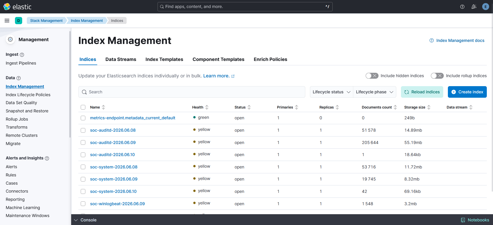
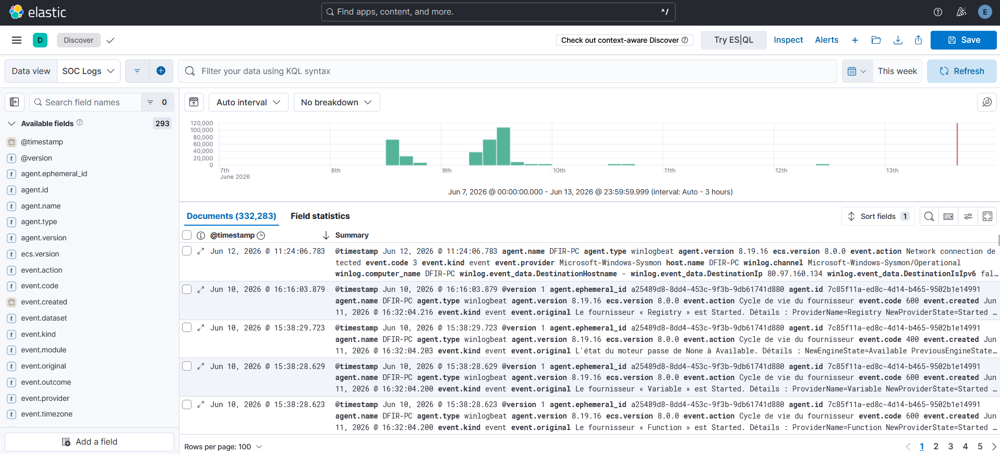

# Homelab SOC - SIEM + Threat Intel

J'ai monté ce lab pour apprendre à détecter des attaques en conditions réelles, pas sur des démos packagées. Tout tourne sur ma machine Windows 11 Pro via VMware Workstation, avec 16 Go de RAM et 50 Go de disque. Stack ELK 8.19.16 + MISP 2.4 + Sysmon + Atomic Red Team sur VMnet8 NAT.

> **Use Cases de détection** : dans mon repo [`soc-lab-detection-engineering`](https://github.com/heraclescap/soc-lab-detection-engineering).

---

## Architecture réseau

```
WINDOWS 11 HOST - 16 Go RAM / 50 Go disque
│
└── VMware VMnet8 (NAT) 192.168.126.0/24
     │
     ├── VM ELK - Ubuntu 22.04
     │    192.168.126.10  (4 Go RAM / 25 Go thin)
     │    ├── Elasticsearch 8.19.16  (heap 1024 Mo, TLS auto)
     │    ├── Kibana 8.19.16         (heap 512 Mo, port 5601)
     │    ├── Logstash 8.19.16       (heap 256 Mo, port 5044)
     │    │    ├── Pipeline skoupa      (input Beats :5044 → pipe to-es)
     │    │    └── Pipeline straight-es (routing agent.type → soc-*)
     │    └── Filebeat 8.19.16       (module threatintel → ES direct)
     │
     ├── VM MISP — Ubuntu 22.04
     │    192.168.126.20  (2 Go RAM / 15 Go thin)
     │    ├── MISP 2.4 + MariaDB + Redis + Apache
     │    ├── Filebeat 8.19.16 → Logstash :5044
     │    └── Auditd (règles DFIR)
     │
     └── VM Victim - Windows 11 Pro
          192.168.126.30  (4 Go RAM / 40 Go thin)
          ├── Sysmon 64 (config SwiftOnSecurity)
          ├── Winlogbeat 8.19.16 → Logstash :5044
          ├── Atomic Red Team
          └── Snapshot "clean-sysmon-winlogbeat"
```

---

## Stack technique

| Composant | Version | VM | Rôle |
|-----------|---------|-----|------|
| Elasticsearch | 8.19.16 | ELK | Stockage et indexation des logs |
| Kibana | 8.19.16 | ELK | Visualisation, règles de détection, alertes |
| Logstash | 8.19.16 | ELK | Parsing, routing, GeoIP enrichment |
| Filebeat (threatintel) | 8.19.16 | ELK | Ingestion IOCs MISP → ES direct |
| MISP | 2.4 | MISP | Threat intelligence, feeds IOCs |
| Filebeat (auditd/system) | 8.19.16 | MISP | Logs Linux → Logstash |
| Auditd | - | MISP | Audit syscalls Linux |
| Winlogbeat | 8.19.16 | Victim | Logs Windows → Logstash |
| Sysmon | 64 (SwiftOnSecurity) | Victim | Télémétrie endpoint Windows |
| Atomic Red Team | latest | Victim | Simulation d'attaques MITRE ATT&CK |

---

## Flux de données

```
VM MISP
  Filebeat (auditd + system) → Logstash :5044
    → pipeline skoupa → pipeline straight-es
      → soc-auditd-YYYY.MM.dd
      → soc-system-YYYY.MM.dd

VM Victim
  Winlogbeat → Logstash :5044
    → pipeline skoupa → pipeline straight-es
      → soc-winlogbeat-YYYY.MM.dd

VM ELK
  Filebeat (threatintel) → Elasticsearch direct
    → filebeat-8.19.16 (data stream)
      → 22 000+ IOCs avec threat.indicator.ip

Kibana Security
  Règle Indicator Match
    soc-winlogbeat-* (DestinationIp) ↔ filebeat-* (threat.indicator.ip)
      → Alerte High si match
```

---

## Index Elasticsearch produits

| Index pattern | Source | Notes |
|---------------|--------|-------|
| `soc-winlogbeat-YYYY.MM.dd` | Winlogbeat / VM Victim | Sysmon + Security + PowerShell + WMI |
| `soc-auditd-YYYY.MM.dd` | Filebeat auditd / VM MISP | Syscalls auditd |
| `soc-system-YYYY.MM.dd` | Filebeat system / VM MISP | Syslog + auth Linux |
| `soc-unknown-YYYY.MM.dd` | Fallback Logstash | Events sans event.module ni agent.type connu |
| `filebeat-8.19.16` | Filebeat threatintel / VM ELK | Data stream IOCs MISP |

> J'ai utilisé le préfixe `soc-*` et pas `logs-*` : Logstash ne peut pas écrire dans les data streams Elastic 8.x avec `op_type: index`. `soc-*` contourne le problème.



---

## Data Views Kibana

| Nom | Pattern | Usage |
|-----|---------|-------|
| SOC Logs | `soc-*` | Tous les logs du lab |
| Windows Logs | `soc-winlogbeat-*` | Logs Windows/Sysmon uniquement |
| Linux Auditd Logs | `soc-auditd-*` | Logs auditd VM MISP |
| Linux System Logs | `soc-system-*` | Syslog et auth VM MISP |
| MISP IOCs | `filebeat-*` | Threat intelligence MISP |




---

## Contraintes opérationnelles

Je n'ai jamais fait tourner les 3 VMs en même temps - 16 Go ne suffisent pas. J'ai travaillé en deux modes :

- **Mode config** : ELK + MISP actifs, Filebeat threatintel tourne
- **Mode attaque** : ELK + Victim actifs, Filebeat arrêté pour libérer ~400 Mo

Voir [`docs/modes_travail.md`](docs/modes_travail.md) pour les commandes de basculement.

---

## Documentation

| Fichier | Contenu |
|---------|---------|
| [`architecture/network_design.md`](architecture/network_design.md) | Topologie réseau, adressage IP, ports |
| [`architecture/known_limitations.md`](architecture/known_limitations.md) | Ce que j'ai appris à mes dépens |
| [`elk/setup_guide.md`](elk/setup_guide.md) | Installation et configuration ELK |
| [`misp/setup_guide.md`](misp/setup_guide.md) | Installation MISP, quirks documentés |
| [`misp/feeds_config.md`](misp/feeds_config.md) | Feeds activés avec justifications |
| [`docs/log_sources.md`](docs/log_sources.md) | Sources de logs, Event IDs, règles auditd |
| [`docs/modes_travail.md`](docs/modes_travail.md) | Comment je bascule entre les modes, santé du lab |
| [`docs/known_limitations.md`](docs/known_limitations.md) | Ce qu'il faut savoir avant de travailler avec ce lab |

---

## Licence

MIT - voir [LICENSE](LICENSE).
