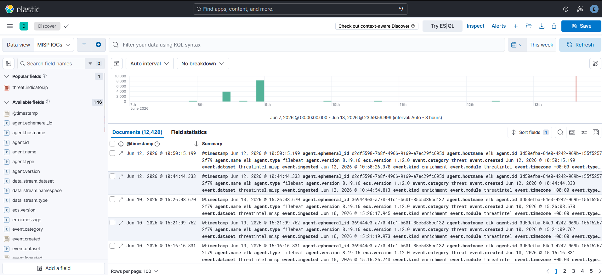
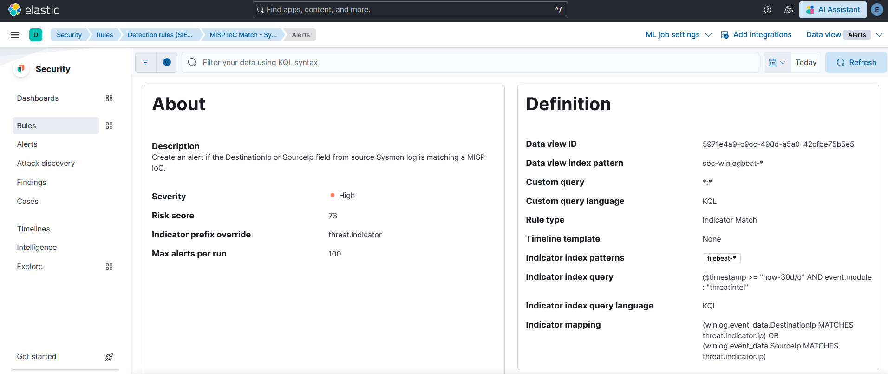
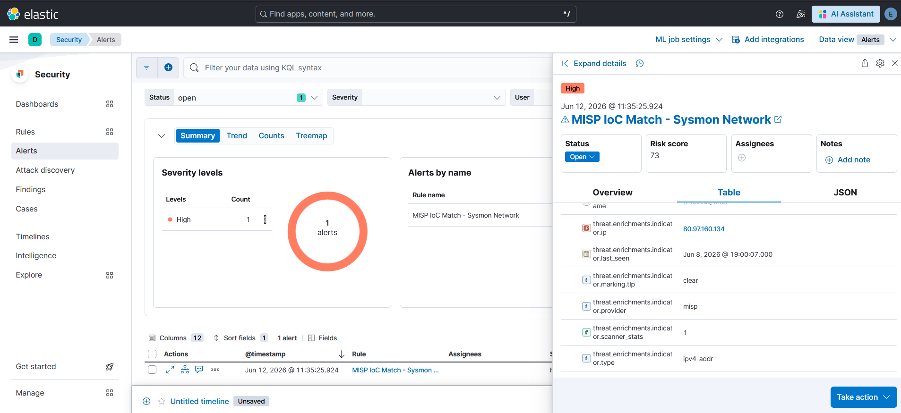
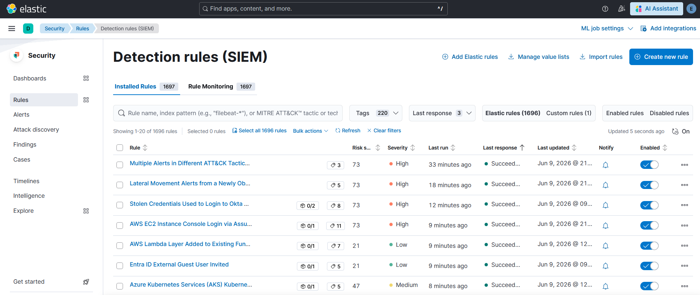

# Ce qu'il faut savoir avant de travailler avec ce lab

Les comportements qui surprennent, et comment les gérer. Version orientée usage quotidien - pour les détails techniques, voir [`architecture/known_limitations.md`](../architecture/known_limitations.md).

---

## "Je ne vois aucun IOC dans Kibana Discover"

L'ingestion initiale prend quelques minutes après le premier démarrage de Filebeat. Si la Data View `MISP IOCs` est vide, vérifier que Filebeat threatintel a bien publié des events (`sudo journalctl -fu filebeat | grep "events published"`). Une fois les IOCs peuplés, ils apparaissent normalement avec `@timestamp`.



---

## "L'index soc-winlogbeat ne reçoit plus d'events Windows"

Vérifications rapides sur VM ELK :

```bash
sudo journalctl -u logstash | grep "winlogbeat" | tail -10
ss -tlnp | grep 5044
```

Sur VM Victim (PowerShell) :

```powershell
Get-Service winlogbeat
# Si Stopped : Start-Service winlogbeat
```

Si les events arrivent dans `soc-unknown-*` plutôt que `soc-winlogbeat-*`, le pipeline `straight_es.conf` a probablement un problème de routing. La première condition doit être `agent.type == "winlogbeat"`.

---

## "La règle Indicator Match ne génère aucune alerte"

Je vérifie dans cet ordre :

1. **Index indicator** : doit être `filebeat-8.19.16`, pas `filebeat-*`
2. **Mapping OR** : les deux mappings (DestinationIp et SourceIp) doivent être en OR
3. **Filtre temporel** : le filtre `@timestamp >= "now-30d/d"` exclut les IOCs anciens. Si `threat.indicator.ip` est vide, les ingest pipelines n'ont pas tourné - vérifier que le Filebeat threatintel utilise bien `output.elasticsearch`
4. **Règle désactivée** : Kibana Security → Rules → vérifier que la règle est "Enabled"





---

## "La création de règle dans Kibana Security échoue silencieusement"

Les 3 clés `xpack.*.encryptionKey` sont manquantes dans `/etc/kibana/kibana.yml`.

```bash
openssl rand -hex 32  # à répéter 3 fois
sudo nano /etc/kibana/kibana.yml
# Ajouter les 3 clés xpack
sudo systemctl restart kibana
```

---

## "Kibana est très lent ou OOM"

En mode attaque, Filebeat tourne encore et consomme ~400 Mo.

```bash
sudo systemctl stop filebeat
```

Autre cause : 1696 règles prebuilt actives toutes les 5 minutes. Je les passe à 1h via Kibana Security → Rules → Elastic rules → Select all → Bulk actions → Update rule schedules.



---

## "Les index soc-* n'existent pas dans Kibana"

Ils se créent au premier event reçu. Si aucun event n'est arrivé : vérifier que Winlogbeat ou Filebeat MISP envoient bien vers Logstash :5044. Pour tester rapidement : `sudo touch /etc/shadow` sur VM MISP, ou attendre les logs natifs Windows sur VM Victim.

---

## "auditd ne génère rien sur cat /etc/shadow"

Normal. Mes règles auditd utilisent `-p wa` uniquement - les lectures ne sont pas capturées. Pour capturer les lectures, ajouter `-p r` aux règles dans `/etc/audit/rules.d/dfir.rules`. Attention au volume avec `-S execve -p r`.

---

## "MISP ne répond plus après un restart"

```bash
sudo systemctl status misp-workers
sudo systemctl restart misp-workers
sudo systemctl status mariadb
```

La queue `default` des workers MISP est souvent la coupable.

---

## "Les index prennent trop de place"

La policy ILM `soc-policy` gère la rétention : hot 5 GB/3j, warm 3j, delete 14j. Pour forcer la progression :

```bash
curl -sk -u elastic:'<MOT_DE_PASSE_ELASTIC>' \
  -X POST "https://192.168.126.10:9200/soc-*/_ilm/retry"
```

---

## Rappel RAM

| Mode | VMs actives | RAM consommée | Marge |
|------|------------|---------------|-------|
| Config | ELK + MISP | ~10 Go | 6 Go |
| Attaque | ELK + Victim | ~12 Go | 4 Go |
| 3 VMs | ELK + MISP + Victim | ~14 Go | 2 Go - risqué |

Les 3 VMs simultanées, c'est faisable mais pas recommandé.
