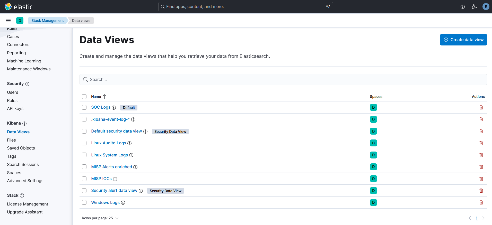
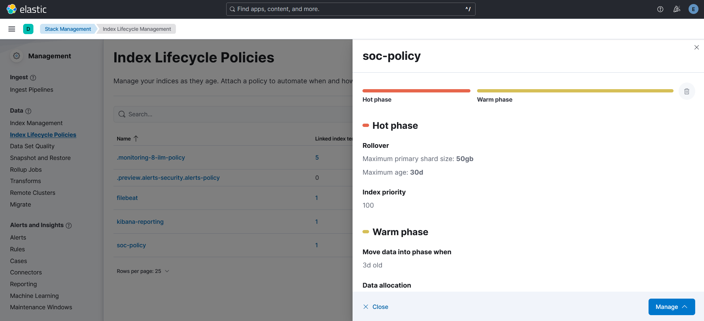

# ELK Setup Guide

Mes étapes d'installation sur la VM ELK - Ubuntu 22.04, IP 192.168.126.10. Tout le stack est en version 8.19.16.

---

## Prérequis VM

```
OS    : Ubuntu 22.04 LTS Server
RAM   : 4096 Mo
CPU   : 2 cœurs
Disk  : 25 Go thin provisioned
Net   : VMnet8 NAT - IP statique 192.168.126.10/24
```

IP statique via `/etc/netplan/00-installer-config.yaml` :

```yaml
network:
  version: 2
  ethernets:
    ens33:
      dhcp4: false
      addresses: [192.168.126.10/24]
      routes:
        - to: default
          via: 192.168.126.2
      nameservers:
        addresses: [8.8.8.8]
```

```bash
sudo chmod 600 /etc/netplan/00-installer-config.yaml
sudo netplan apply
```

---

## 1. Elasticsearch

### Installation

```bash
wget -qO - https://artifacts.elastic.co/GPG-KEY-elasticsearch \
  | sudo gpg --dearmor -o /usr/share/keyrings/elasticsearch-keyring.gpg

echo "deb [signed-by=/usr/share/keyrings/elasticsearch-keyring.gpg] \
  https://artifacts.elastic.co/packages/8.x/apt stable main" \
  | sudo tee /etc/apt/sources.list.d/elastic-8.x.list

sudo apt update && sudo apt install elasticsearch -y
```

> Le mot de passe du compte `elastic` s'affiche une seule fois à la fin de l'installation. À noter immédiatement. Si perdu : `sudo /usr/share/elasticsearch/bin/elasticsearch-reset-password -u elastic`

### Tuning JVM heap

Fichier : `/etc/elasticsearch/jvm.options.d/heap.options`

```
-Xms1024m
-Xmx1024m
```

J'ai réduit à 1024 Mo au lieu de 1500 Mo pour que Kibana et Logstash puissent coexister sur 4 Go de RAM.

### Configuration minimale

Elastic 8.x auto-configure TLS et xpack.security au premier démarrage. Ne pas écraser le fichier existant. J'ai ajouté uniquement ces lignes en tête de `/etc/elasticsearch/elasticsearch.yml`, avant le bloc `BEGIN SECURITY AUTO CONFIGURATION` :

```yaml
cluster.name: homelab-soc
node.name: elk-node-1
discovery.type: single-node
```

J'ai également commenté `cluster.initial_master_nodes` dans le bloc auto-configuré.

### Démarrage

```bash
sudo systemctl daemon-reload
sudo systemctl enable elasticsearch
sudo systemctl start elasticsearch

# Validation
curl -k -u elastic:'<MOT_DE_PASSE_ELASTIC>' https://192.168.126.10:9200
# Attendu : {"cluster_name":"homelab-soc", ...}
```

---

## 2. Kibana

### Installation

```bash
sudo apt install kibana -y
```

### Configuration

Fichier : `/etc/kibana/kibana.yml` - j'ai ajouté en bas du fichier :

```yaml
server.host: "192.168.126.10"
server.port: 5601
elasticsearch.hosts: ["https://192.168.126.10:9200"]
elasticsearch.ssl.verificationMode: none
elasticsearch.username: "kibana_system"
elasticsearch.password: "<MOT_DE_PASSE_KIBANA_SYSTEM>"

# Ces 3 clés sont obligatoires pour les règles Indicator Match dans Kibana Security.
# Sans elles, la création de règle échoue silencieusement - j'ai perdu du temps là-dessus.
# Générer avec : openssl rand -hex 32
xpack.encryptedSavedObjects.encryptionKey: "<CLE_32_CHARS>"
xpack.security.encryptionKey: "<CLE_32_CHARS>"
xpack.reporting.encryptionKey: "<CLE_32_CHARS>"
```

### Définir le mot de passe kibana_system

```bash
curl -k -u elastic:'<MOT_DE_PASSE_ELASTIC>' \
  -X POST "https://192.168.126.10:9200/_security/user/kibana_system/_password" \
  -H "Content-Type: application/json" \
  -d '{"password":"<MOT_DE_PASSE_KIBANA_SYSTEM>"}'
# Réponse attendue : {}
```

### Limiter la mémoire Kibana

```bash
echo "--max-old-space-size=512" | sudo tee -a /etc/kibana/node.options
```

### Démarrage

```bash
sudo systemctl enable kibana
sudo systemctl start kibana
# Compter 2-3 minutes avant que Kibana soit accessible
```

Après le premier démarrage, j'ai activé la licence Trial dans Kibana → Stack Management → License Management → Start Trial. C'est nécessaire pour Kibana Security.

---

## 3. Logstash multi-pipeline

### Installation et tuning heap

```bash
sudo apt install logstash -y
```

Dans `/etc/logstash/jvm.options`, j'ai réduit le heap :

```
-Xms256m
-Xmx256m
```

### Architecture multi-pipeline

J'ai mis en place deux pipelines séparés plutôt qu'un fichier monolithique :

- **skoupa** : reçoit les events Beats sur le port 5044 et les envoie en interne
- **straight-es** : route chaque event vers le bon index selon sa source

Fichier de configuration : [`logstash/pipelines.yml`](logstash/pipelines.yml)
Pipeline skoupa : [`logstash/skoupa.conf`](logstash/skoupa.conf)
Pipeline straight-es : [`logstash/straight_es.conf`](logstash/straight_es.conf)

```bash
sudo mkdir -p /etc/logstash/pipeline
# Copier les 3 fichiers vers leurs emplacements (voir les commentaires en tête de chaque fichier)
```

### Démarrage et validation

```bash
sudo systemctl enable logstash
sudo systemctl start logstash

sudo journalctl -fu logstash | grep "Pipeline started"
# Les 2 pipelines doivent apparaître : skoupa et straight-es

ss -tlnp | grep 5044
```

---

## 4. Filebeat threatintel (sur VM ELK)

Filebeat est sur la VM ELK uniquement pour le module threatintel. Il utilise `output.elasticsearch` direct et pas Logstash - c'est obligatoire pour que les ingest pipelines ECS s'exécutent et peuplent `threat.indicator.ip`. Voir [architecture/known_limitations.md](../architecture/known_limitations.md) pour les détails.

```bash
sudo apt install filebeat -y
```

Configuration : [`filebeat-threatintel/filebeat.yml.example`](filebeat-threatintel/filebeat.yml.example)

```bash
# Charger les ingest pipelines avant le premier démarrage - ne pas oublier cette étape
sudo filebeat setup --pipelines --modules threatintel

sudo systemctl enable filebeat
sudo systemctl start filebeat
```

---

## 5. Data Views Kibana

Kibana → Stack Management → Data Views → Create data view :

| Nom | Index pattern | Timestamp |
|-----|---------------|-----------|
| SOC Logs | `soc-*` | @timestamp |
| Windows Logs | `soc-winlogbeat-*` | @timestamp |
| Linux Auditd Logs | `soc-auditd-*` | @timestamp |
| Linux System Logs | `soc-system-*` | @timestamp |
| MISP IOCs | `filebeat-*` | @timestamp |



---

## 6. ILM Policy

Policy `soc-policy` que j'ai configurée :

- Hot : max 5 GB / max 3 jours
- Warm : 3 jours, readonly + shrink 1 shard + forcemerge 1 segment
- Delete : 14 jours

Fichier JSON : [`kibana/ilm_policy.json`](kibana/ilm_policy.json)

À appliquer via Kibana → Stack Management → Index Lifecycle Policies → Create policy. Ensuite j'ai créé un index template `soc-template` avec pattern `soc-*` et `number_of_replicas: 0` pour éviter les warnings "yellow" en single-node.


